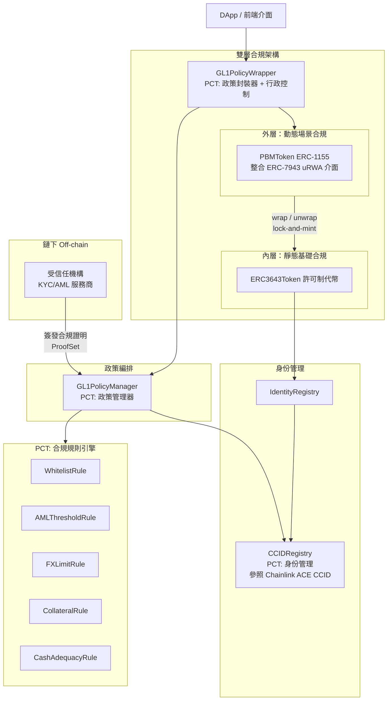
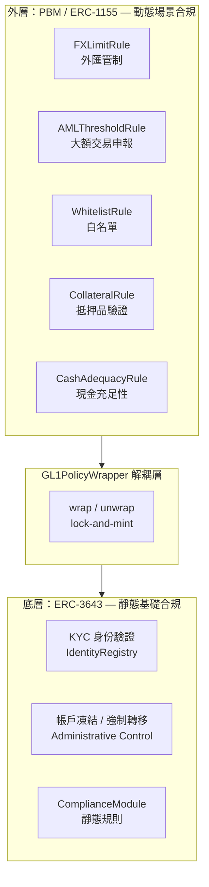
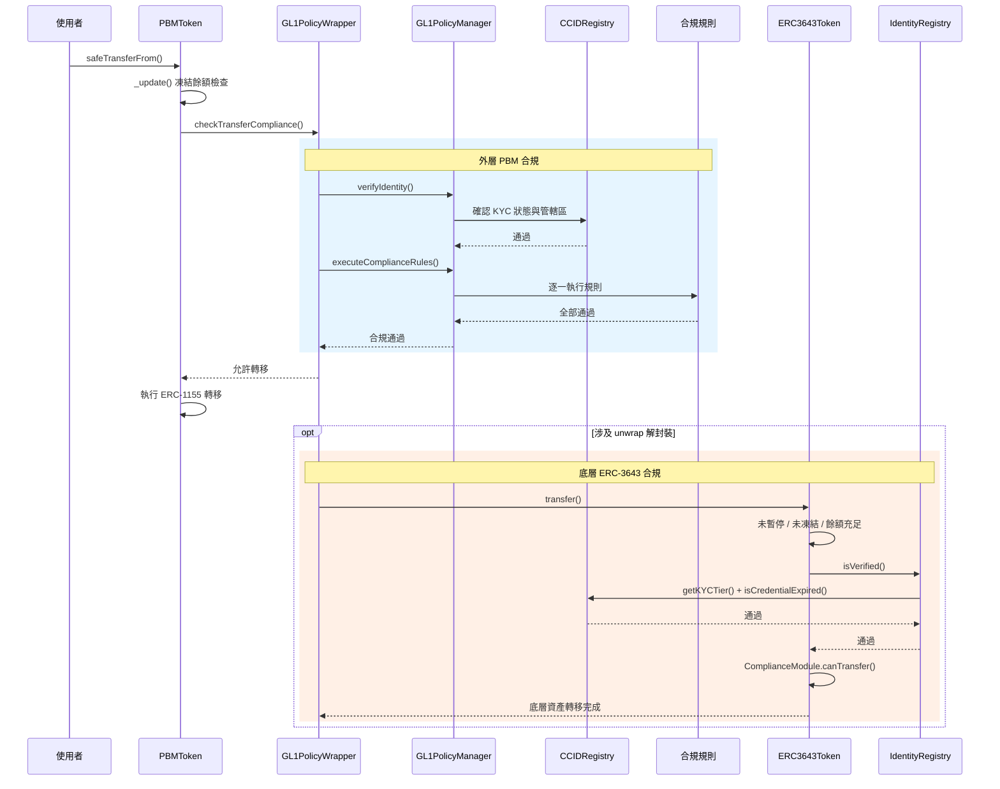
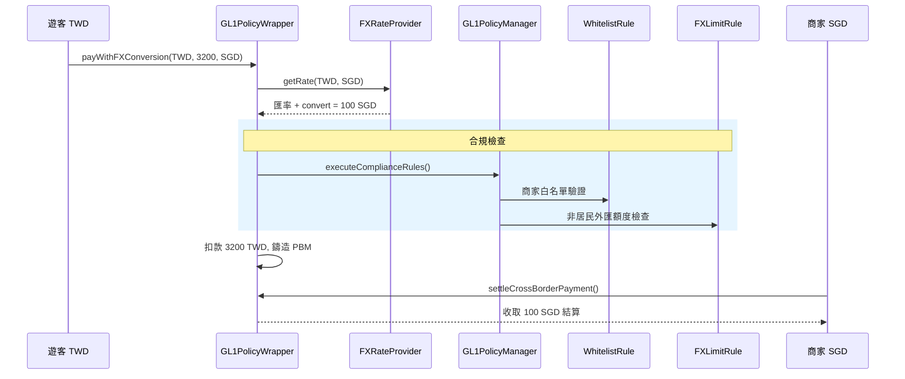
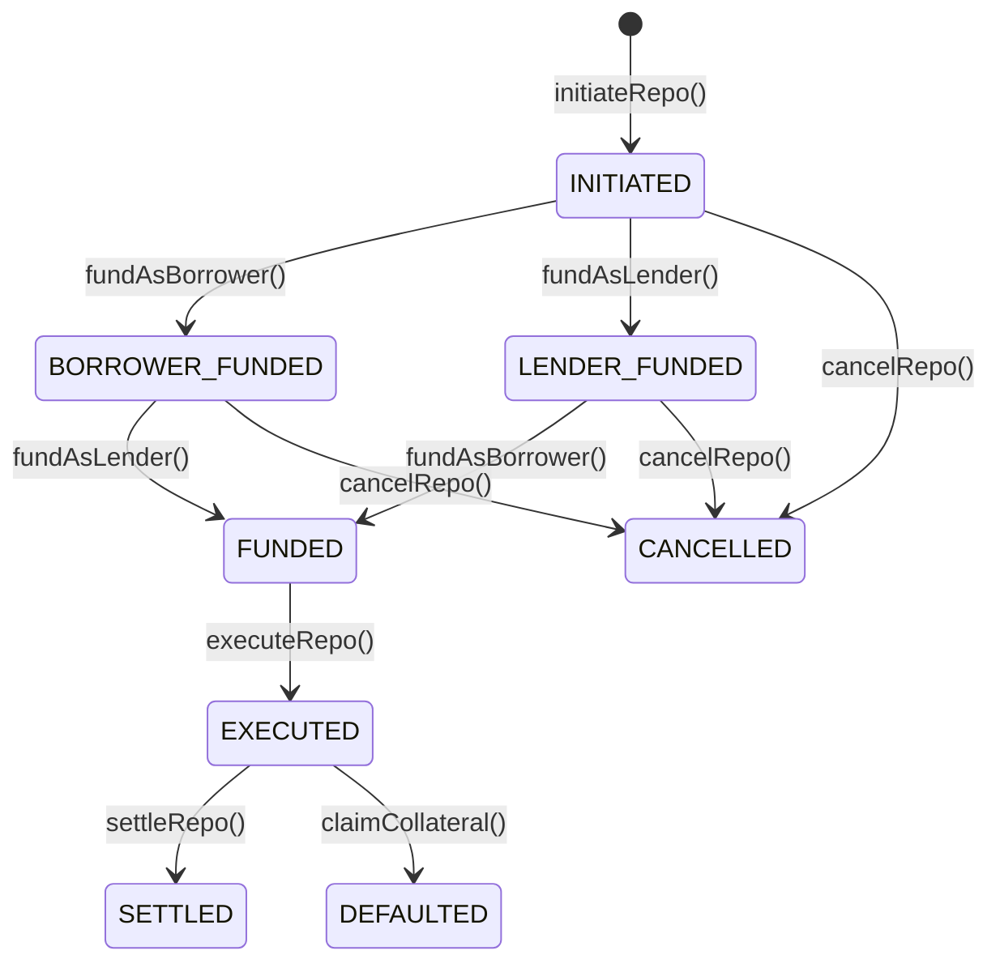

# 第三章 系統設計與架構

本章以「如何設計」為核心，說明系統各組件的架構決策與互動方式。有關各技術標準（ERC-3643、ERC-7943、PBM、Chainlink ACE、CAST Framework）的原理與背景，已於第二章詳述，本章僅聚焦於本系統如何運用這些技術進行設計與整合。

---

## 第一節 系統總體架構

本系統依據 GL1 四層參考模型進行設計，各智能合約模組對應至相應層級。下圖展示本系統的總體架構：

註：RepoContract、FXRateProvider 等屬於應用場景層級的合約，將於第五節說明。圖中以「PCT:」標示各合約對應之 GL1 可程式合規工具組模組。

上圖各組件在 GL1 四層參考模型中的對應如下：

- 接入層（Access Layer）：DApp / 前端介面
- 服務層（Service Layer）：GL1PolicyManager（政策編排）、CCIDRegistry（身份管理）、合規規則引擎（五個 Rule 合約）
- 資產層（Asset Layer）：GL1PolicyWrapper（政策封裝器）、PBMToken（外層 PBM）、ERC3643Token（底層許可制代幣）、IdentityRegistry
- 平台層（Platform Layer）：Ethereum / EVM 兼容鏈

合約間調用鏈：使用者呼叫 GL1PolicyWrapper → GL1PolicyWrapper 委派 GL1PolicyManager 進行合規驗證 → GL1PolicyManager 依序呼叫 CCIDRegistry（身份）與各規則合約（規則） → 驗證通過後 GL1PolicyWrapper 透過 PBMToken 鑄造 PBM 代幣。此分層確保職責分離，新增規則僅需部署新合約並註冊，無需修改現有合約。

---

## 第二節 雙層合規架構設計：PBM 封裝 ERC-3643

本節為本研究的核心架構創新。傳統單層合規將所有邏輯集中於代幣合約，面對多場景、跨管轄區的需求時缺乏彈性。本研究提出「PBM 封裝 ERC-3643」之雙層合規架構，將合規職責劃分為靜態與動態兩層，透過 GL1PolicyWrapper 實現解耦。

### 壹、設計理念：靜態合規與動態合規的職責劃分

底層（ERC-3643）負責靜態/基礎合規：

- KYC 身份驗證：ERC3643Token 的 transfer() 自動呼叫 identityRegistry.isVerified()，IdentityRegistry 再橋接至 CCIDRegistry 進行 KYC 等級與有效期雙重確認。
- 帳戶凍結與強制轉移：setAddressFrozen()、freezePartialTokens() 提供帳戶或部分餘額凍結；forcedTransfer() 實現法律強制轉移；pause() 提供緊急斷路器。
- ComplianceModule：可插拔的靜態規則模組（如持有人數上限），每次成功轉帳後記錄交易。

外層（PBM / ERC-1155）負責動態/場景合規：

- FXLimitRule：根據 CCIDRegistry 中的身份標籤（居民/非居民）檢查外匯累計額度。
- CollateralRule / CashAdequacyRule：Repo 場景中的抵押率（≥ 150%）與現金充足性驗證。
- AMLThresholdRule：大額交易申報與拆分偵測。
- WhitelistRule：動態管理的白名單，支援鏈上與鏈下兩種驗證模式。

解耦價值：GL1PolicyWrapper 透過 wrap() 將 ERC-3643 代幣封裝為 PBM 時自動附加外層規則，無需修改底層合約。同一份 ERC-3643 代幣可在不同場景中配置不同規則集——跨境支付適用 FXLimitRule + WhitelistRule，Repo 適用 CollateralRule + CashAdequacyRule。

### 貳、ERC-7943 在雙層架構中的角色

PBMToken 實作 IERC7943MultiToken 介面，作為外層動態合規的標準化技術基礎。具體而言：

- canTransact(account)：透過低階調用查詢 GL1PolicyWrapper，判斷地址是否具備交易資格。
- canTransfer(from, to, tokenId, amount)：整合資格驗證與凍結餘額檢查，動態判斷轉帳是否合規。
- setFrozenTokens(account, tokenId, amount)：REGULATOR_ROLE 可凍結特定帳戶的特定 tokenId 金額。
- forcedTransfer(from, to, tokenId, amount)：REGULATOR_ROLE 可強制轉移資產。

ERC-7943 的極簡介面與底層 ERC-3643 的完整許可制設計形成互補：ERC-3643 在底層提供深度身份管理與帳戶控制，ERC-7943 在外層提供通用合規介面，兩層不重疊、不衝突。

### 參、雙層合規觸發順序

以一筆 PBM 轉帳交易為例，雙層合規觸發順序如下：

此流程確保不存在合規盲點——外層動態場景合規與內層靜態身份合規共同構成完整的監理覆蓋。合規通過後，GL1PolicyWrapper 會生成 ComplianceProof 記錄（含交易雜湊、時戳、驗證者地址、適用規則清單）作為留存證據。

---

## 第三節 身份管理架構設計

本系統採用雙層身份管理：IdentityRegistry 提供 ERC-3643 兼容的身份註冊，CCIDRegistry 擴展跨鏈身份與細粒度標籤能力。

### 壹、IdentityRegistry 簡化實作

設計決策：本系統以 address 型態取代完整的 ONCHAINID 身份合約。InvestorIdentity 結構僅包含 identity（代表地址）、country（ISO-3166 國家代碼）與 registered（是否已註冊）三個欄位。

核心功能：

- registerIdentity() / updateIdentity() / deleteIdentity() / updateCountry()：AGENT_ROLE 管理投資者身份。
- batchRegisterIdentity()：批量註冊，提升大規模部署效率。
- isVerified()：核心查詢函數，整合三階段身份確認：
  1. 檢查地址是否已在 IdentityRegistry 註冊
  2. 透過 CCIDProvider 確認 KYC 等級是否有效（非零值）
  3. 確認 KYC 憑證未過期

三項全部通過才回傳 true，該地址才能進行 ERC-3643 轉帳。

設計取捨：簡化降低了部署成本與複雜度，但犧牲了 ONCHAINID 的自主錢包恢復能力。本系統透過 ERC3643Token 的 recoveryAddress() 函數提供替代方案——AGENT_ROLE 可將舊錢包代幣轉移至新錢包，但需依賴代理人介入，不若 ONCHAINID 的多密鑰機制來得去中心化。

### 貳、CCIDRegistry 跨鏈身份註冊表

CCIDRegistry 參照第二章所述之 Chainlink ACE CCID 概念設計，提供跨鏈且符合隱私法規的身份管理。

一、隱私設計原則

鏈上僅儲存 identityHash（身份雜湊）、kycTimestamp、tier 等去識別化元資料，不儲存任何 PII。即使鏈上資料被讀取也不會洩露敏感個資。

二、多層級 KYC 分級

| KYC 等級           | 說明               | 適用場景          |
| ------------------ | ------------------ | ----------------- |
| TIER_NONE          | 無 KYC，預設狀態   | 不具交易資格      |
| TIER_BASIC         | 基礎身份驗證       | 小額交易          |
| TIER_FULL          | 完整身份與文件審核 | 一般金融交易      |
| TIER_INSTITUTIONAL | 法人全面盡職調查   | Repo 等機構間交易 |

三、身份標籤管理

| 標籤             | 用途                                              |
| ---------------- | ------------------------------------------------- |
| TAG_RESIDENT     | 適用本國監管標準                                  |
| TAG_NON_RESIDENT | 觸發外匯管制規則（FXLimitRule）                   |
| TAG_CORPORATE    | 適用法人特定合規                                  |
| TAG_SANCTIONED   | 立即禁止所有交易，發出 SanctionStatusChanged 事件 |

規則合約可根據標籤自動觸發差異化的監管邏輯。

四、跨鏈地址映射

linkCrossChainAddress() 可將同一實體在不同鏈上的地址進行綁定（Ethereum、Polygon、BSC）。系統預設支援三條鏈。此功能實現「一次 KYC、多鏈使用」。

五、管轄區權限管理

透過 approveJurisdiction() / revokeJurisdiction() 管理帳戶在各管轄區的操作權限，與 GL1PolicyManager 的管轄區規則映射協同運作。

---

## 第四節 政策管理器與合規規則引擎設計

GL1PolicyManager 作為 PCT 架構的協調層，負責編排身份驗證、規則引擎與外部服務之間的互動。

### 壹、GL1PolicyManager 規則編排架構

一、RuleSet 結構

每個 RuleSet 包含：

| 欄位            | 類型    | 說明                                    |
| --------------- | ------- | --------------------------------------- |
| ruleSetId       | bytes32 | 唯一識別碼                              |
| ruleType        | string  | 規則類型（如 WHITELIST、AML_THRESHOLD） |
| isOnChain       | bool    | 鏈上即時執行 or 鏈下簽署驗證            |
| executorAddress | address | 規則合約地址                            |
| priority        | uint256 | 執行優先級（越小越先）                  |
| isActive        | bool    | 可隨時啟用/停用，無需重新部署           |

透過 registerRuleSet() 註冊，僅限 RULE_ADMIN_ROLE。

二、多管轄區規則映射

jurisdictionRules 映射建立管轄區與規則集的對應。setJurisdictionRules() 為特定管轄區配置適用規則集。驗證時根據交易的管轄區代碼查詢並依序執行。跨境交易可能需通過多個管轄區各自的規則。

三、多方角色驗證（verifyPartyCompliance）

針對 Repo 等多方交易，verifyPartyCompliance(party, role, jurisdictionCode) 執行兩階段驗證：

1. 呼叫 verifyIdentity() 確認 KYC 與管轄區權限
2. 根據角色（LENDER / BORROWER / CUSTODIAN）執行對應的規則集

不同角色適用不同規則，反映差異化監管需求。

四、混合執行模式

透過 isOnChain 標記支援兩種模式無縫切換：

- 鏈上模式（isOnChain = true）：直接呼叫規則合約的 checkCompliance()，適用於簡單規則（白名單、餘額閾值）。
- 鏈下模式（isOnChain = false）：驗證鏈下受信任機構簽發的數位簽章，適用於複雜規則（AML 模糊比對、制裁名單篩選）。

兩種模式可在同一管轄區混合使用。

### 貳、ProofSet 與離線檢驗機制

ProofSet 承載鏈下受信任機構的合規證明，在 GL1PolicyWrapper 的 wrap() 中提交。鏈上驗證流程：

1. 檢查簽署者是否為系統認可的受信任機構
2. 驗證數位簽章的密碼學有效性
3. 確認簽章時效性（時間窗口與過期）

三項全部通過方可作為有效合規背書。此設計落實了第二章第八節所探討的「離線檢驗、鏈上驗證」混成機制。

### 參、信任模型與失效場景分析

本小節正面回應「合規即程式碼」與「離線檢驗」之間的內在張力。

（一）信任根源（Root of Trust）

本系統採「許可制聯邦」模式：合規證明需獲得授權簽署者簽章。目前實作為單一授權簽署者，需承認存在「單點故障」風險。緩解措施包括：法律層面的代理協議提供問責機制（參照第二章 CAST Framework），以及架構預留 M-of-N 多方簽署擴展能力。

（二）簽章有效性與資料真實性的落差（Oracle Problem）

核心挑戰：智能合約只能驗證「簽章是否為真」，無法驗證「合規判斷是否正確」。信任假設為「鏈下預言機所輸入數據真實反映現實法律狀態」。GIGO 風險：若鏈下機構被入侵，鏈上合約將無條件放行。採用此設計的理由已於第二章第八節分析——這是處理大規模 AML 比對與隱私保護的必要技術權衡。

（三）活性假設與阻斷風險（Liveness Assumption）

鏈下服務必須保持高可用性。本系統採安全失效（Fail-safe）模式：鏈下服務失效時暫停所有離線簽署交易，拒絕放行未驗證交易（Fail-open）。純鏈上規則不受影響，可作為基礎防線。服務恢復後可依鏈上狀態機重建。

（四）隱私信任邊界（Privacy Trust Boundary）

基於「數據最小化」原則：鏈下機構承擔 PII 保管的法律責任，鏈上僅儲存去識別化雜湊。鏈上信任鏈下的「判斷結果」，原始資料不上鏈，技術層面滿足 GDPR 要求。

---

## 第五節 應用場景機制設計

本節設計兩個代表性金融場景——零售端跨境消費與機構端資金融通——驗證雙層合規架構的場景適應能力。

### 壹、跨境支付場景設計

場景：台灣遊客在新加坡商家消費，支付 TWD 穩定幣，商家收取 SGD 結算。

FX 匯率轉換架構：FXRateProvider 以 USD 為基準貨幣，透過 Chainlink Price Feed 取得各貨幣匯率。非直接支援的貨幣對以交叉匯率計算（TWD/SGD = (TWD/USD) / (SGD/USD)）。支援 TWD、SGD、USD、CNY 四種貨幣，並可切換至手動匯率模式。匯率設有過期時間防護。

結算流程：

合規檢查點：

- WhitelistRule：驗證商家地址是否具備收款資格
- FXLimitRule：根據遊客「非居民」標籤檢查當日累計外匯額度

### 貳、附買回交易（Repo）場景設計

場景：金融機構間短期資金融通。Borrower 以代幣化公債（ERC-3643）作抵押品，向 Lender 借入現金。

Repo 狀態機：

抵押品鎖定機制：

1. Borrower 的底層 ERC-3643 公債事先透過 wrap() 封裝為 PBM Token（底層資產鎖定於 GL1PolicyWrapper）
2. fundAsBorrower() 時，抵押品 PBM 從 Borrower 轉入 RepoContract 鎖定（自動觸發外層合規檢查）
3. 存續期間任何一方均無法單獨提取。僅 settleRepo() 或 claimCollateral() 依狀態機邏輯釋放

原子交換確保抵押品鎖定與現金交付在同一交易完成，不存在一方已付出而另一方未履行的中間風險。

合規檢查點：

| 階段                | 規則                  | 驗證內容                                 |
| ------------------- | --------------------- | ---------------------------------------- |
| Borrower 存入抵押品 | CollateralRule        | 抵押率 ≥ 150%                            |
| Lender 存入現金     | CashAdequacyRule      | PBM 餘額充足                             |
| 雙方注資            | verifyPartyCompliance | 按角色（BORROWER/LENDER）差異化 KYC 驗證 |
