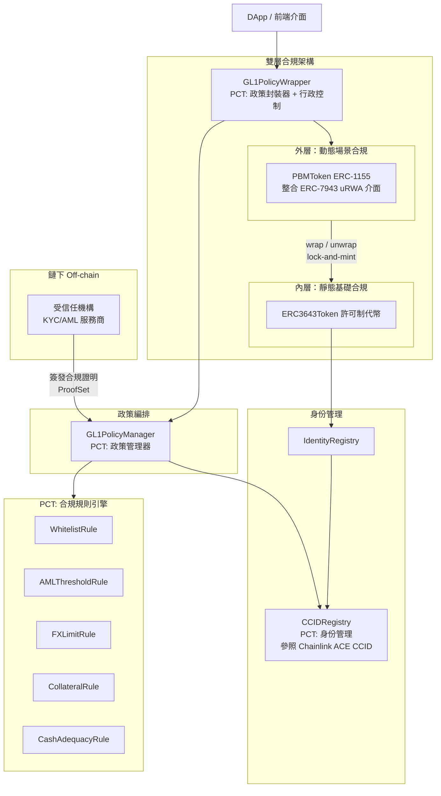
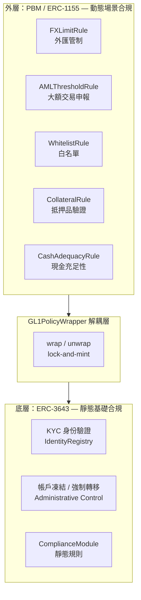
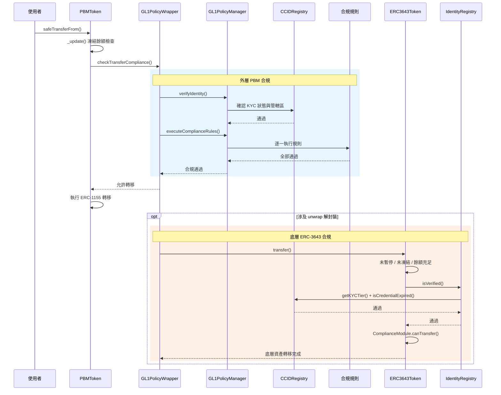
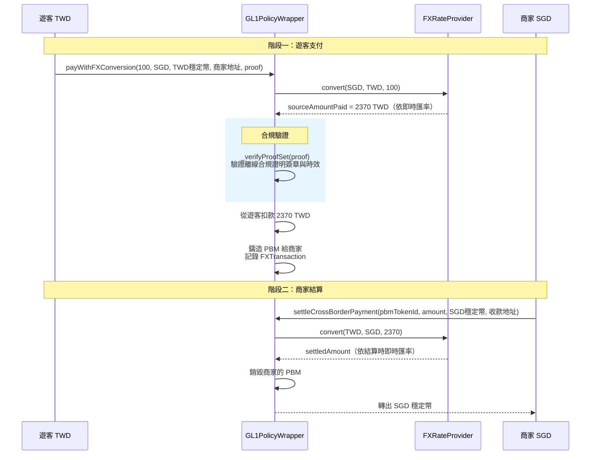
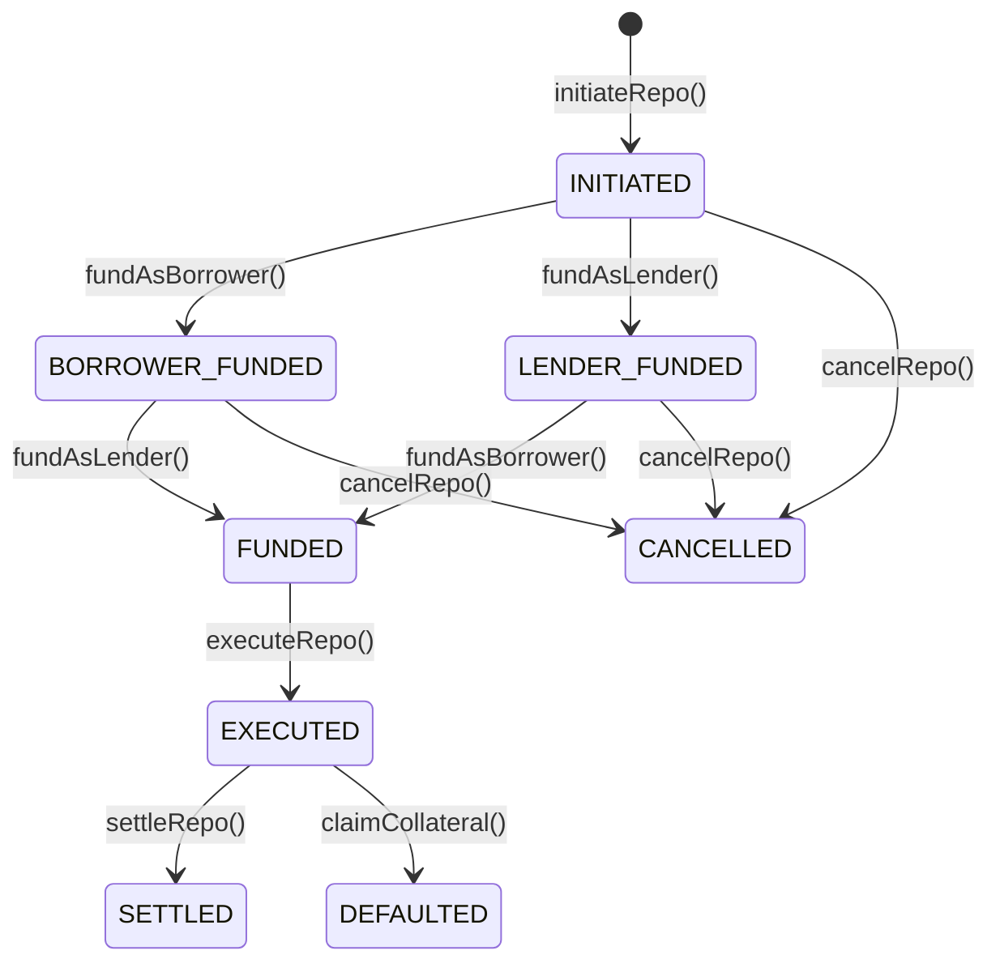

# 第三章 系統設計與架構

本章以「如何設計」為核心，說明系統各組件的架構決策與互動方式。有關各技術標準（ERC-3643、ERC-7943、PBM、Chainlink ACE、CAST Framework）的原理與背景，已於第二章詳述，本章僅聚焦於本系統如何運用這些技術進行設計與整合。

---

## 第一節 系統總體架構

本系統依據 GL1 四層參考模型進行設計，各智能合約模組對應至相應層級。下圖展示本系統的總體架構：

```mermaid
graph TB
    subgraph OffChain["鏈下 Off-chain"]
        TI["受信任機構<br/>KYC/AML 服務商"]
    end

    DApp["DApp / 前端介面"]

    subgraph PolicyOrchestration["政策編排"]
        PM["GL1PolicyManager<br/>PCT: 政策管理器"]
    end

    subgraph Identity["身份管理"]
        CCID["CCIDRegistry<br/>PCT: 身份管理<br/>參照 Chainlink ACE CCID"]
        IR["IdentityRegistry"]
    end

    subgraph RuleEngine["PCT: 合規規則引擎"]
        WR["WhitelistRule"]
        AML["AMLThresholdRule"]
        FX["FXLimitRule"]
        CLR["CollateralRule"]
        CR["CashAdequacyRule"]
    end

    subgraph DualLayer["雙層合規架構"]
        PW["GL1PolicyWrapper<br/>PCT: 政策封裝器 + 行政控制"]
        subgraph OuterPBM["外層：動態場景合規"]
            PBM["PBMToken ERC-1155<br/>整合 ERC-7943 uRWA 介面"]
        end
        subgraph InnerERC["內層：靜態基礎合規"]
            ERC["ERC3643Token 許可制代幣"]
        end
        PW --> OuterPBM
        OuterPBM -->|"wrap / unwrap<br/>lock-and-mint"| InnerERC
    end

    TI -->|"簽發合規證明<br/>ProofSet"| PM
    DApp --> PW
    PW --> PM
    PM --> CCID
    PM --> RuleEngine
    IR --> CCID
    ERC --> IR
```

註：RepoContract、FXRateProvider 等屬於應用場景層級的合約，將於第五節說明。圖中以「PCT:」標示各合約對應之 GL1 可程式合規工具組模組。

上圖各組件在 GL1 四層參考模型中的對應如下：

- 接入層（Access Layer）：DApp / 前端介面
- 服務層（Service Layer）：GL1PolicyManager（政策編排）、CCIDRegistry（身份管理）、合規規則引擎（五個 Rule 合約）
- 資產層（Asset Layer）：GL1PolicyWrapper（政策封裝器）、PBMToken（外層 PBM）、ERC3643Token（底層許可制代幣）、IdentityRegistry
- 平台層（Platform Layer）：Ethereum / EVM 兼容鏈

合約間調用鏈：使用者呼叫 GL1PolicyWrapper → GL1PolicyWrapper 委派 GL1PolicyManager 進行合規驗證 → GL1PolicyManager 依序呼叫 CCIDRegistry（身份）與各規則合約（規則） → 驗證通過後 GL1PolicyWrapper 透過 PBMToken 鑄造 PBM 代幣。此分層確保職責分離，新增規則僅需部署新合約並註冊，無需修改現有合約。

---

## 第二節 雙層合規架構設計：PBM 封裝 ERC-3643

本節為本研究的核心架構創新。傳統單層合規將所有邏輯集中於代幣合約，面對多場景、跨管轄區的需求時缺乏彈性。本研究提出「PBM 封裝 ERC-3643」之雙層合規架構，將合規職責劃分為靜態與動態兩層，透過 GL1PolicyWrapper 實現解耦。

### 壹、設計理念：靜態合規與動態合規的職責劃分

```mermaid
graph TB
    subgraph OuterLayer["外層：PBM / ERC-1155 — 動態場景合規"]
        FXL["FXLimitRule<br/>外匯管制"]
        AMLR["AMLThresholdRule<br/>大額交易申報"]
        WLR["WhitelistRule<br/>白名單"]
        COLR["CollateralRule<br/>抵押品驗證"]
        CASHR["CashAdequacyRule<br/>現金充足性"]
    end

    subgraph Wrapper["GL1PolicyWrapper 解耦層"]
        W["wrap / unwrap<br/>lock-and-mint"]
    end

    subgraph InnerLayer["底層：ERC-3643 — 靜態基礎合規"]
        KYC["KYC 身份驗證<br/>IdentityRegistry"]
        Freeze["帳戶凍結 / 強制轉移<br/>Administrative Control"]
        CM["ComplianceModule<br/>靜態規則"]
    end

    OuterLayer --> Wrapper --> InnerLayer
```

底層（ERC-3643）負責靜態/基礎合規：

- KYC 身份驗證：ERC3643Token 的 transfer() 自動呼叫 identityRegistry.isVerified()，IdentityRegistry 再橋接至 CCIDRegistry 進行 KYC 等級與有效期雙重確認。
- 帳戶凍結與強制轉移：setAddressFrozen()、freezePartialTokens() 提供帳戶或部分餘額凍結；forcedTransfer() 實現法律強制轉移；pause() 提供緊急斷路器。
- ComplianceModule：可插拔的靜態規則模組（如持有人數上限），每次成功轉帳後記錄交易。

外層（PBM / ERC-1155）負責動態/場景合規：

- FXLimitRule：根據 CCIDRegistry 中的身份標籤（居民/非居民）檢查外匯累計額度。
- CollateralRule / CashAdequacyRule：Repo 場景中的抵押率（≥ 150%）與現金充足性驗證。
- AMLThresholdRule：大額交易申報與拆分偵測。
- WhitelistRule：動態管理的白名單，支援鏈上與鏈下兩種驗證模式。

解耦價值：GL1PolicyWrapper 透過 wrap() 將 ERC-3643 代幣封裝為 PBM 時自動附加外層規則，無需修改底層合約。同一份 ERC-3643 代幣可在不同場景中配置不同規則集——跨境支付適用 FXLimitRule + WhitelistRule，Repo 適用 CollateralRule + CashAdequacyRule。

### 貳、ERC-7943 在雙層架構中的角色

PBMToken 實作 IERC7943MultiToken 介面，作為外層動態合規的標準化技術基礎。具體而言：

- canTransact(account)：透過低階調用查詢 GL1PolicyWrapper，判斷地址是否具備交易資格。
- canTransfer(from, to, tokenId, amount)：整合資格驗證與凍結餘額檢查，動態判斷轉帳是否合規。
- setFrozenTokens(account, tokenId, amount)：REGULATOR_ROLE 可凍結特定帳戶的特定 tokenId 金額。
- forcedTransfer(from, to, tokenId, amount)：REGULATOR_ROLE 可強制轉移資產。

ERC-7943 的極簡介面與底層 ERC-3643 的完整許可制設計形成互補：ERC-3643 在底層提供深度身份管理與帳戶控制，ERC-7943 在外層提供通用合規介面，兩層不重疊、不衝突。

### 參、雙層合規觸發順序

以一筆 PBM 轉帳交易為例，雙層合規觸發順序如下：

```mermaid
sequenceDiagram
    participant User as 使用者
    participant PBM as PBMToken
    participant PW as GL1PolicyWrapper
    participant PM as GL1PolicyManager
    participant CCID as CCIDRegistry
    participant Rule as 合規規則
    participant ERC as ERC3643Token
    participant IR as IdentityRegistry

    User->>PBM: safeTransferFrom()
    PBM->>PBM: _update() 凍結餘額檢查
    PBM->>PW: checkTransferCompliance()

    rect rgb(230, 245, 255)
        Note over PW,Rule: 外層 PBM 合規
        PW->>PM: verifyIdentity()
        PM->>CCID: 確認 KYC 狀態與管轄區
        CCID-->>PM: 通過
        PW->>PM: executeComplianceRules()
        PM->>Rule: 逐一執行規則
        Rule-->>PM: 全部通過
        PM-->>PW: 合規通過
    end

    PW-->>PBM: 允許轉移
    PBM->>PBM: 執行 ERC-1155 轉移

    opt 涉及 unwrap 解封裝
        rect rgb(255, 240, 230)
            Note over PW,IR: 底層 ERC-3643 合規
            PW->>ERC: transfer()
            ERC->>ERC: 未暫停 / 未凍結 / 餘額充足
            ERC->>IR: isVerified()
            IR->>CCID: getKYCTier() + isCredentialExpired()
            CCID-->>IR: 通過
            IR-->>ERC: 通過
            ERC->>ERC: ComplianceModule.canTransfer()
            ERC-->>PW: 底層資產轉移完成
        end
    end
```

此流程確保不存在合規盲點——外層動態場景合規與內層靜態身份合規共同構成完整的監理覆蓋。合規通過後，GL1PolicyWrapper 會生成 ComplianceProof 記錄（含交易雜湊、時戳、驗證者地址、適用規則清單）作為留存證據。

---

## 第三節 身份管理架構設計

本系統採用雙層身份管理：IdentityRegistry 提供 ERC-3643 兼容的身份註冊，CCIDRegistry 擴展跨鏈身份與細粒度標籤能力。

### 壹、IdentityRegistry 實作

設計決策：InvestorIdentity 結構包含 identity（代表地址）、country（ISO-3166 國家代碼）與 registered（是否已註冊）三個欄位。

核心功能：

- registerIdentity() / updateIdentity() / deleteIdentity() / updateCountry()：AGENT_ROLE 管理投資者身份。
- batchRegisterIdentity()：批量註冊，提升大規模部署效率。
- isVerified()：核心查詢函數，整合三階段身份確認：
  1. 檢查地址是否已在 IdentityRegistry 註冊
  2. 透過 CCIDProvider 確認 KYC 等級是否有效
  3. 確認 KYC 憑證未過期

三項全部通過才回傳 true，該地址才能進行轉帳。

透過 ERC3643Token 的 recoveryAddress() 函數提供錢包恢復——AGENT_ROLE 可將舊錢包代幣轉移至新錢包。

### 貳、CCIDRegistry 跨鏈身份註冊表

CCIDRegistry 參照第二章所述之 Chainlink ACE CCID 概念設計，提供跨鏈且符合隱私法規的身份管理。

一、隱私設計原則

鏈上僅儲存 identityHash（身份雜湊）、kycTimestamp、tier 等去識別化元資料，不儲存任何 PII。即使鏈上資料被讀取也不會洩露敏感個資。

二、多層級 KYC 分級

| KYC 等級           | 說明               | 適用場景     |
| ------------------ | ------------------ | ------------ |
| TIER_NONE          | 無 KYC，預設狀態   | 不具交易資格 |
| TIER_BASIC         | 基礎身份驗證       | 小額交易     |
| TIER_FULL          | 完整身份與文件審核 | 一般金融交易 |
| TIER_INSTITUTIONAL | 法人全面盡職調查   | 機構間交易   |

三、身份標籤管理

| 標籤             | 用途                                              |
| ---------------- | ------------------------------------------------- |
| TAG_RESIDENT     | 適用本國監管標準                                  |
| TAG_NON_RESIDENT | 觸發外匯管制規則（FXLimitRule）                   |
| TAG_CORPORATE    | 適用法人特定合規                                  |
| TAG_SANCTIONED   | 立即禁止所有交易，發出 SanctionStatusChanged 事件 |

規則合約可根據標籤自動觸發差異化的監管邏輯。

四、跨鏈地址映射

linkCrossChainAddress(primaryAddress, chainId, linkedAddress, proof) 可將同一實體在不同鏈上的地址進行綁定，由具備 CROSS_CHAIN_BRIDGE_ROLE 的跨鏈橋接合約執行。函數會檢查目標鏈是否在支援清單中（supportedChains）、主地址身份是否為啟用狀態，並要求附帶證明資料（proof 參數，預留 ZK 證明或多簽驗證擴展）。系統預設支援 Ethereum、Polygon、Arbitrum、Optimism 四條鏈，管理員可透過 setChainSupport() 動態新增或移除支援的鏈。getCrossChainAddress() 則提供反向查詢，取得特定主地址在指定鏈上的對應地址。此機制實現「一次 KYC、多鏈使用」——實體僅需在一條鏈上完成 KYC 註冊，即可將身份映射至其他鏈使用。

五、管轄區權限管理

CCIDRegistry 透過 jurisdictionApproval 映射（address → jurisdiction → bool）記錄每個帳戶在各管轄區的操作權限。KYC_PROVIDER_ROLE 呼叫 approveJurisdiction() 核准帳戶在特定管轄區操作，或呼叫 revokeJurisdiction() 撤銷權限。

verifyCredential(account, jurisdiction) 函數整合三項檢查：身份是否啟用、KYC 是否未過期、該帳戶是否持有對應管轄區的核准。三項全部通過才回傳 true。此機制與 GL1PolicyManager 的管轄區規則映射協同運作——GL1PolicyManager 根據交易涉及的管轄區代碼查詢適用規則集，而 CCIDRegistry 負責確認參與者是否具備該管轄區的操作資格。跨境交易的雙方可能分屬不同管轄區，需各自通過所屬管轄區的驗證。

---

## 第四節 政策管理器與合規規則引擎設計

GL1PolicyManager 作為 PCT 架構的協調層，負責編排身份驗證、規則引擎與外部服務之間的互動。

### 壹、GL1PolicyManager 規則編排架構

一、RuleSet 結構

每個 RuleSet 包含：

| 欄位            | 類型    | 說明                                    |
| --------------- | ------- | --------------------------------------- |
| ruleSetId       | bytes32 | 唯一識別碼                              |
| ruleType        | string  | 規則類型（如 WHITELIST、AML_THRESHOLD） |
| isOnChain       | bool    | 鏈上即時執行 or 鏈下簽署驗證            |
| executorAddress | address | 規則合約地址                            |
| priority        | uint256 | 執行優先級（越小越先）                  |
| isActive        | bool    | 可隨時啟用/停用，無需重新部署           |

透過 registerRuleSet() 註冊，僅限 RULE_ADMIN_ROLE。

二、多管轄區規則映射

jurisdictionRules 映射建立管轄區與規則集的對應。setJurisdictionRules() 為特定管轄區配置適用規則集。驗證時根據交易的管轄區代碼查詢並依序執行。跨境交易可能需通過多個管轄區各自的規則。

三、多方角色驗證（verifyPartyCompliance）

針對 Repo 等多方交易，verifyPartyCompliance(party, role, jurisdictionCode) 執行兩階段驗證：

1. 呼叫 verifyIdentity() 確認 KYC 與管轄區權限
2. 根據角色（LENDER / BORROWER / CUSTODIAN）執行對應的規則集

不同角色適用不同規則，反映差異化監管需求。

四、混合執行模式

透過 isOnChain 標記支援兩種模式無縫切換：

- 鏈上模式（isOnChain = true）：直接呼叫規則合約的 checkCompliance()，適用於簡單規則（白名單、餘額閾值）。
- 鏈下模式（isOnChain = false）：驗證鏈下受信任機構簽發的數位簽章，適用於複雜規則（AML 模糊比對、制裁名單篩選）。

兩種模式可在同一管轄區混合使用。

### 貳、ProofSet 與離線檢驗機制

ProofSet 承載鏈下受信任機構的合規證明，在 GL1PolicyWrapper 的 wrap() 中提交。使用者提交至鏈上的內容包含兩部分：原始合規訊息（明文，含帳戶地址、檢查結果、時間戳等）以及受信任機構對該訊息的數位簽章。數位簽章並非加密——原始訊息以明文傳輸，簽章僅為附帶的密碼學證明。鏈上驗證流程如下：

1. 檢查簽署者是否為系統認可的受信任機構：在以太坊中，每個帳戶的地址由私鑰經橢圓曲線運算產生公鑰，再經 Keccak256 雜湊取最後 20 bytes 而得。受信任機構使用其私鑰對訊息摘要（Hash）進行 ECDSA 簽名，產生簽章值 (v, r, s)。由於簽章的數學結構與簽署者的私鑰綁定，鏈上合約可透過 Solidity 內建的 ecrecover()（Elliptic Curve Recover）函數，僅憑訊息摘要與簽章值即可反向推導出簽署者的公鑰，進而計算出其地址。合約將此地址與預先註冊的受信任機構地址比對——若一致，表示簽章確為該機構所簽發；若不一致則拒絕。全程無需接觸私鑰。
2. 驗證數位簽章的密碼學有效性：上述 ecrecover 同時保證訊息完整性——若訊息內容遭到任何篡改，重新計算的訊息摘要將與簽名時使用的摘要不同，導致 ecrecover 還原出截然不同的地址，驗證即告失敗。
3. 確認簽章時效性（防範重放攻擊）：合規狀態可能隨時間變化（例如帳戶事後遭列入制裁名單），若不設時間限制，攻擊者可持過去取得的有效簽章無限期重複使用。因此原始訊息中包含簽發時間戳，智能合約將該時間戳與鏈上區塊時間（block.timestamp）比對，確認簽章仍在預設的有效時間窗口內（例如 24 小時），過期即拒絕，強制要求重新取得最新的合規證明。

三項全部通過方可作為有效合規背書。此設計落實了第二章第八節所探討的「離線檢驗、鏈上驗證」混成機制。

### 參、信任模型與失效場景分析（Trust Model & Failure Analysis）

「信任模型」是指系統在運作時預設了哪些角色是可信的、可信到什麼程度；「失效場景」則分析當這些信任假設不成立時（例如受信任機構遭入侵或斷線），系統會受到什麼影響以及如何應對。離線檢驗機制將部分合規判斷委託給鏈下受信任機構，因此引入了額外的信任假設。本小節逐一分析此設計的信任根源、潛在風險與對應的緩解措施。

（一）信任根源（Root of Trust）

本系統的合規證明並非任何人都可以簽發，而是僅限系統管理員預先授權的機構才能簽署——這就是「許可制」的含義。GL1PolicyWrapper 合約中設有 `trustedSigner` 狀態變數，記錄當前授權簽署者的地址。`_verifyProofSet()` 函數在驗證 ProofSet 時效性後，使用 OpenZeppelin 的 ECDSA（Elliptic Curve Digital Signature Algorithm，橢圓曲線數位簽章演算法）函式庫進行簽章驗證——其原理與前述 ProofSet 驗證流程相同：將 ProofSet 核心欄位（proofType、credentialHash、issuedAt、expiresAt、issuer）編碼並雜湊，加上 EIP-191 前綴後，透過 `ECDSA.recover()` 從簽章還原簽署者地址，與 `trustedSigner` 比對——僅完全吻合時才接受該合規證明。

目前實作中僅設定單一授權簽署者，因此存在「單點故障」風險：若該機構離線或被入侵，整個離線合規管道即失效。針對此風險，本系統有兩項緩解措施：

- 法律問責：依據第二章 CAST Framework 的設計，授權簽署者須與系統營運方簽訂代理協議，明確約定其合規判斷的法律責任。若簽署者簽發不實的合規證明，可依據協議追究法律責任，以法律層面的嚇阻力補強技術層面的信任。
- 多方簽署擴展（未來工作）：由於 `trustedSigner` 的設計為單一地址，未來可直接將其設為 Gnosis Safe 等多簽錢包地址，無需修改合約即可實現 M-of-N 多方簽署——即要求 N 個授權機構中至少 M 個同意（例如 3 個機構中至少 2 個簽署），消除單點故障。

（二）簽章有效性與資料真實性的落差（Oracle Problem）

ECDSA 簽章驗證能確保「這份合規證明確實是授權機構簽發的」，但無法確保「授權機構的合規判斷本身是否正確」。換言之，智能合約只能驗證「誰說的」，無法驗證「說的對不對」——這就是所謂的預言機問題（Oracle Problem）。

此限制帶來的具體風險是：若鏈下受信任機構遭到入侵或發生錯誤，簽發了不實的合規證明（例如將實際未通過 AML 審查的帳戶標記為「通過」），鏈上合約會因為簽章本身有效而照常放行——垃圾進、垃圾出（Garbage In, Garbage Out）。然而，大規模 AML 模糊比對與制裁名單篩選涉及敏感個人資料（姓名、身分證號碼等），在鏈上公開執行既不可行（運算成本過高），也不符合隱私法規（如 GDPR）的數據最小化原則，因此委託鏈下專業機構處理是目前的必要技術權衡。

（三）活性假設與阻斷風險（Liveness Assumption）

所謂「活性假設」（Liveness Assumption），是指系統預設鏈下服務會持續可用；「阻斷風險」（Blocking Risk）則是這個假設不成立時所產生的影響。離線合規機制依賴鏈下受信任機構持續在線並簽發合規證明。若該機構因當機、網路中斷或遭受攻擊而無法回應，使用者將無法取得有效的 ProofSet，所有需要離線簽署的交易（如 wrap）都會被阻斷。

本系統對此採取「寧可拒絕、不可放行」的設計原則：當鏈下服務無法使用時，合約不會跳過驗證直接放行，而是拒絕所有未經簽章驗證的交易。這意味著系統可用性會暫時降低，但不會因為缺少合規檢查而產生監管漏洞。純鏈上規則（如 WhitelistRule、CollateralRule）不依賴鏈下服務，在此期間仍可正常運作，作為基礎防線。

（四）隱私信任邊界（Privacy Trust Boundary）

隱私信任邊界是指鏈上與鏈下之間「誰負責保管個資」的責任分界線。合規審查不可避免地需要處理個人敏感資料（PII，如姓名、身分證號碼、地址等），但這些資料不應出現在公開的區塊鏈上。本系統的做法是將隱私責任明確劃分為兩層：鏈下受信任機構負責保管原始個資並執行合規判斷，鏈上僅儲存經過雜湊處理後的去識別化摘要（如 CCIDRegistry 中的 `identityHash`）——即使鏈上資料被任何人讀取，也無法反推出原始個資。鏈上合約信任的是鏈下機構的「判斷結果」（通過或不通過），而非原始資料本身。此設計符合 GDPR 等隱私法規所要求的「數據最小化」原則——僅收集與儲存達成目的所必需的最少量資料。

---

## 第五節 應用場景機制設計

本節設計兩個代表性金融場景——零售端跨境消費與機構端資金融通——驗證雙層合規架構的場景適應能力。

### 壹、跨境支付場景設計

場景：台灣遊客在新加坡商家消費，支付 TWD 穩定幣，商家收取 SGD 結算。

一、FX 匯率轉換架構

FXRateProvider 以 USD 為基準貨幣，透過 Chainlink Price Feed 取得各貨幣對 USD 的匯率。當需要查詢非直接支援的貨幣對時（例如 TWD 對 SGD），系統以交叉匯率計算：先分別取得 TWD/USD 與 SGD/USD 的匯率，再以 TWD/SGD = (TWD/USD) ÷ (SGD/USD) 換算——即以 USD 作為中介，間接橋接兩種貨幣之間的匯率。系統目前支援 TWD、SGD、USD、CNY 四種貨幣。

匯率來源支援兩種模式切換：預設使用 Chainlink Price Feed 自動取得去中心化的即時市場匯率；管理員（RATE_ADMIN_ROLE）亦可透過 setUseManualRates() 切換至手動匯率模式，由管理員直接在合約中以 setManualRate() 設定固定匯率值。手動模式適用於 Chainlink 尚未支援的貨幣對、測試開發環境，或監管機構要求使用官方公告匯率的情境。無論何種模式，匯率均設有過期時間防護（stalePeriod，預設 1 小時）——合約透過 isRateStale() 檢查匯率資料的最後更新時間，若距今超過預設時限，即視為過期匯率，避免使用過時報價導致錯誤結算。

二、支付與結算流程

跨境支付以商家標價幣種為基準：商家以 SGD 標價，系統反向計算遊客需支付的 TWD 金額。整體流程分為「遊客支付」與「商家結算」兩個階段：

```mermaid
sequenceDiagram
    participant Tourist as 遊客 TWD
    participant PW as GL1PolicyWrapper
    participant FXP as FXRateProvider
    participant Merchant as 商家 SGD

    Note over Tourist,Merchant: 階段一：遊客支付

    Tourist->>PW: payWithFXConversion(100, SGD, TWD穩定幣, 商家地址, proof)
    PW->>FXP: convert(SGD, TWD, 100)
    FXP-->>PW: sourceAmountPaid = 2370 TWD（依即時匯率）

    rect rgb(230, 245, 255)
        Note over PW: 合規驗證
        PW->>PW: _verifyProofSet(proof)<br/>驗證離線合規證明簽章與時效
    end

    PW->>PW: 從遊客扣款 2370 TWD
    PW->>PW: 鑄造 PBM 給商家<br/>記錄 FXTransaction

    Note over Tourist,Merchant: 階段二：商家結算

    Merchant->>PW: settleCrossBorderPayment(pbmTokenId, amount, SGD穩定幣, 收款地址)
    PW->>FXP: convert(TWD, SGD, 2370)
    FXP-->>PW: settledAmount（依結算時即時匯率）
    PW->>PW: 銷毀商家的 PBM
    PW-->>Merchant: 轉出 SGD 穩定幣
```

流程說明：

1. 遊客呼叫 payWithFXConversion(100, SGD, TWD穩定幣地址, 商家地址, proof)，以商家標價 100 SGD 為基準
2. GL1PolicyWrapper 向 FXRateProvider 查詢 convert(SGD, TWD, 100)，反向換算遊客需支付的 TWD 金額（例如依即時匯率計算為 2370 TWD）
3. 合規驗證：驗證遊客提交的離線合規證明（ProofSet），包含三項核心檢查——確認簽章由 trustedSigner 簽發（簽署者身份）、確認訊息未遭篡改（訊息完整性）、確認簽章在有效期內（時效性）
4. 從遊客扣款 2370 TWD，直接鑄造等額 PBM 給商家（而非先鑄給遊客再轉移）。同時將匯率、雙方地址、來源與目標金額等交易資訊寫入 FXTransaction 記錄，供事後查閱
5. 商家呼叫 settleCrossBorderPayment()，合約再次向 FXRateProvider 即時查詢匯率，將商家持有的 PBM 銷毀，並將底層 TWD 資產依當下匯率轉換為 SGD 穩定幣後發放給商家。由於支付與結算分屬不同時間點且各自查詢即時匯率，商家最終收到的 SGD 金額可能與遊客支付時的換算結果略有差異

三、合規檢查點

跨境支付在不同階段有不同的合規機制：

- 支付階段（payWithFXConversion）：驗證遊客提交的離線合規證明（ProofSet），由 \_verifyProofSet() 執行。PBM 以 mint 方式直接鑄造給商家，mint 操作由 GL1PolicyWrapper（具備 WRAPPER_ROLE）執行，跳過轉帳合規檢查——因為此時資產是從系統合約新鑄造，而非在使用者之間轉移
- PBM 後續轉帳階段：若商家將 PBM 轉移給第三方（透過 safeTransferFrom），PBMToken 的 \_update() 會自動觸發 checkTransferCompliance()，由 GL1PolicyManager 依序執行 WhitelistRule（收款方白名單驗證）與 FXLimitRule（根據「非居民」標籤檢查外匯累計額度）等合規規則

### 貳、附買回交易（Repo）場景設計

場景：金融機構間短期資金融通。Borrower 以代幣化公債（ERC-3643）作抵押品，向 Lender 借入現金。

Repo 狀態機：

```mermaid
stateDiagram-v2
    [*] --> INITIATED: initiateRepo()
    INITIATED --> BORROWER_FUNDED: fundAsBorrower()
    INITIATED --> LENDER_FUNDED: fundAsLender()
    BORROWER_FUNDED --> FUNDED: fundAsLender()
    LENDER_FUNDED --> FUNDED: fundAsBorrower()
    FUNDED --> EXECUTED: executeRepo()
    EXECUTED --> SETTLED: settleRepo()
    EXECUTED --> DEFAULTED: claimCollateral()

    INITIATED --> CANCELLED: cancelRepo()
    BORROWER_FUNDED --> CANCELLED: cancelRepo()
    LENDER_FUNDED --> CANCELLED: cancelRepo()
```

抵押品鎖定機制：

1. Borrower 的底層 ERC-3643 公債事先透過 wrap() 封裝為 PBM Token（底層資產鎖定於 GL1PolicyWrapper）
2. fundAsBorrower() 時，抵押品 PBM 從 Borrower 轉入 RepoContract 鎖定（自動觸發外層合規檢查）
3. 存續期間任何一方均無法單獨提取。僅 settleRepo() 或 claimCollateral() 依狀態機邏輯釋放

原子交換確保抵押品鎖定與現金交付在同一交易完成，不存在一方已付出而另一方未履行的中間風險。

合規檢查點：

| 階段                | 規則                  | 驗證內容                                 |
| ------------------- | --------------------- | ---------------------------------------- |
| Borrower 存入抵押品 | CollateralRule        | 抵押率 ≥ 150%                            |
| Lender 存入現金     | CashAdequacyRule      | PBM 餘額充足                             |
| 雙方注資            | verifyPartyCompliance | 按角色（BORROWER/LENDER）差異化 KYC 驗證 |
